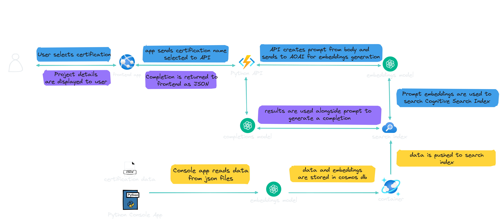

# Cloud Project Generator API

A API built with Azure Functions, Python, Azure OpenAI, Azure Cosmos DB, and Azure Cognitive Services to generate project ideas for those studying for cloud certifications.

## Diagram

## Resources

- [All Things Open Keynote Slides](https://1drv.ms/p/s!AlqgVriKH8xEhaE0G66EmObpTqueiw?e=58gbA1)
- [An AI Powered Journey to Learning Python Slides](https://1drv.ms/p/s!AlqgVriKH8xEhaEvnrYjWr5TOCWABQ?e=PG0Fkh)
- [More notes and resources here](https://github.com/madebygps/cosmos-vector-aoai)
- [Azure Cognitive Search Vector Search demo](https://github.com/microsoft/AzureDataRetrievalAugmentedGenerationSamples/blob/main/Python/CosmosDB-NoSQL_CognitiveSearch/CosmosDB_CogSearch_AzureOpenAI_Tutorial.ipynb)

